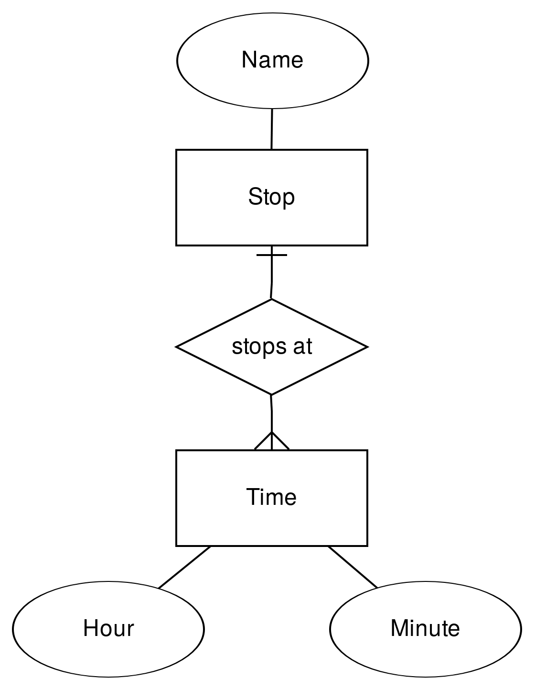
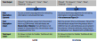
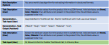

<!-- .slide: class="section" -->

<header>
	<h1>Budoucnost</h1>
	
Mohou stroje pracovat za nás (programátory)?

</header>

---

# Současný stav

 <!-- .element: style="float:right;height:700px" -->

- Manuální programování, aka **Webscraping**
    - Ruční tvorba programů, které z HTML kódu extrahují, co je třeba
- Platformy pro zpřístupnění obsahu dokumentů přes API
    - Integrace ručně vytvořených scraperů
    - **Přístup ``manufaktura''**

---

# Inteligentní extrakce

Tzn. bez ``ruční práce'' v podobě hledání elementů, regulárních výrazů, CSS selektorů, XPath výrazů, apod.

1. **Strojové učení**
	- ``Naučení'' extraktoru na anotovaných příkladech
2. **Jazykové modely**
	- Text dokumentu nebo kód jako součást promptu
3. **Modelem řízená extrakce**
	- Specifikace předpokládané struktury dat (ER diagram?, *ontologie*, ...)
	- Nalezení výskytu požadovaných skupin dat ve zdrojové stránce

---

# Strojové učení -- scénář

- Trénovací množina dokumentů
	- Obvykle dokumenty z jednoho zdroje
	- Anotace částí obsahu, které se mají extrahovat
	- Odvození pravidel pro extrakci
- Množina nových, neznámých dokumentů
	- Extrakce dat na základě odvozených pravidel

---

# Strojové učení -- metody

- Sekvenční modely stránky (znaky, tokeny)
	- Inference gramatik (*wrapper induction*), skryté Markovovy modely, ...
- Hierarchické modely
	- Zobecněný DOM (odstranění implementačních detailů)
	- Stromové automaty
- Vizuální modely dokumentů
	- Segmentace stránek
	- Klasifikace na základě vizuálních rysů

---

# Modelem řízená extrakce

 <!-- .element: style="float:right;height:700px" -->

- Vstup: Entity, atributy, vztahy
- Přibližné rozpoznání jednotlivých údajů
	- Regulární výrazy
	- Klasifikace textu nebo vizuálních vlastností
	- Mapování na databázi
- Nalezení datových záznamů
	- Využití pravidelnosti, opakující se vzory

---

# Jazykové modely

- Předáme text nebo kód dokumentu a ptáme se

Je-li toto stránka produktu, jak se tento produkt jmenuje a kolik stojí?

- V případě webových stránek poněkud drahý přístup
	- Použití LLM se platí per-token
	- Lokální použití se platí výpočetní náročností

---

# Jazykové modely - prompty

- Zero-shot prompt
	- Pouze instrukce (cíl extrakce), žádné příklady
- One (few)-shot prompt
	- Příklady hodnot atributů
	- Příklady zdrojových dat a očekávaných výsledků
- Specifikace cílového formátu odpovědi
	- Instrukce (použij JSON, názvy atributů)
	- Schéma (Ukázka JSON s příklady, JSON Schema, ...)

A. Brinkmann et al.: <a href="https://arxiv.org/abs/2310.12537">ExtractGPT: Exploring the Potential of Large Language Models for Product Attribute Value Extraction</a>

---

# Příklad promptu - zero shot

 <!-- .element: style="height:700px" -->

---

# Příklad promptu s příklady

 <!-- .element: style="height:700px" -->

---

# AI agenti

- LLM nejen analyzuje vstup, ale i řídí nástroje
	- Popíšeme schopnosti a API dostupných nástrojů textově
	- Dáme instrukci k vykonání činnosti
	- LLM generuje sekvenci příkazů pro nástroje a analyzuje výstup
- Mnoho dostupných nástrojů
	- Např. [LangChain](https://www.langchain.com/) obsahuje i [rozhraní pro Playwright](https://python.langchain.com/docs/integrations/tools/playwright/)
