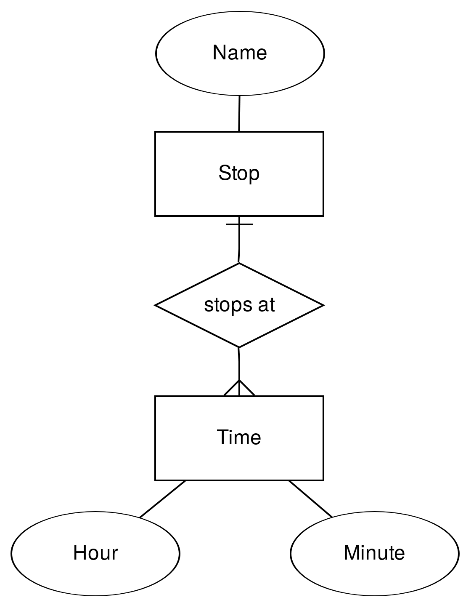

<!-- .slide: class="section" -->

<header>
	<h1>A co dál</h1>
	
Co zatím ani jazykové modely neumí spolehlivě.

</header>

---

# Strojové učení -- scénář

- Trénovací množina dokumentů
	- Obvykle dokumenty z jednoho zdroje
	- Anotace částí obsahu, které se mají extrahovat
	- Odvození pravidel pro extrakci
- Množina nových, neznámých dokumentů
	- Extrakce dat na základě odvozených pravidel

---

# Strojové učení -- metody

- Sekvenční modely stránky (znaky, tokeny)
	- Inference gramatik (*wrapper induction*), skryté Markovovy modely, ...
- Hierarchické modely
	- Zobecněný DOM (odstranění implementačních detailů)
	- Stromové automaty
- Vizuální modely dokumentů
	- Segmentace stránek
	- Klasifikace na základě vizuálních rysů

---

# Modelem řízená extrakce

 <!-- .element: style="float:right;height:700px" -->

- Vstup: Entity, atributy, vztahy
- Přibližné rozpoznání jednotlivých údajů
	- Regulární výrazy
	- Klasifikace textu nebo vizuálních vlastností
	- Mapování na databázi
- Nalezení datových záznamů
	- Využití pravidelnosti, opakující se vzory
- Cíl: **garantovat**, že výsledek sedí na schéma a že se nic neztratilo

Note:
Tohle je přesně ta vlastnost, kterou jazykový model sám o sobě nedává.
Model vrátí něco, co vypadá správně. Modelem řízená extrakce vychází
ze schématu a umí říct, které entity a atributy se ve stránce nenašly.
