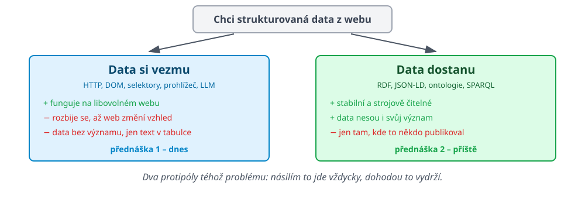

# Příště: data dohodou

 <!-- .element: width="100%" -->

- Dnes jsme si data **brali**. Příště se podíváme, co se stane, když je někdo publikuje **dobrovolně a strojově čitelně**.

Note:
Uzavření oblouku: tentýž obrázek jako na druhém slajdu dnešní přednášky,
tentokrát s důrazem na pravou stranu.

---

# Tři řádky místo tří set

Největší česká města i s počtem obyvatel &ndash; **bez jediného řádku scraperu**:

```sparql
SELECT ?mestoLabel ?obyvatel WHERE {
  ?mesto wdt:P31 wd:Q5153359 ;       # je statutární město
         wdt:P1082 ?obyvatel .       # má počet obyvatel
  SERVICE wikibase:label { bd:serviceParam wikibase:language "cs". }
}
ORDER BY DESC(?obyvatel)
```

```
Praha    1397880
Brno      402739
Ostrava   283187
Plzeň     187928
```

- ??Žádný parser, žádné selektory, **a nerozbije se to při redesignu webu**
- ??Co je `wdt:P1082` a proč to funguje &ndash; [příští přednáška](https://gitshow.net/https/difs-teaching.github.io/slides/upa/semanticky_web)

Note:
Dotaz je živý, běží na query.wikidata.org. Když zbude čas, pustit ho naživo.
Kontrast s první částí přednášky je záměrný: tohle je přesně ta úloha,
na kterou by student jinak psal scraper nad Wikipedií.
