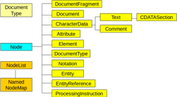

# Modely HTML dokumentů

- Řetězec znaků
	- Jednoduchá implementace, rychlost, škálovatelnost
	- Regulární výrazy, HLRT wrappery
- Řetězec tokenů
	- Lexikální analyzátor rozpozná tagy, entity, text, apod.
	- HLRT wrappery
- Hierarchické modely
	- Nejčastěji DOM
	- Případně ``odlehčená'' varianta

---

# Wrapper

- Uvažujeme *n* datových polí, které se mají extrahovat z dokumentu
- Různé třídy wrapperů: LR, HLRT, ...
- HLRT wrapper:
	- **H**ead -- podřetězec před datovým blokem
	- **L**eft -- levý oddělovač (pro každé datové pole)
	- **R**ight -- pravý oddělovač (pro každé datové pole)
	- **T**tail -- podřetězec za datovým blokem

`$$ wrapper = (h, t, l_1, r_1, l_2, r_2, \dots, l_n, r_n ) $$`

<p class="cite">
Nicholas Kushmerick:
<em>Wrapper induction: Efficiency and expressiveness,</em>
Artificial Intelligence,
Volume 118, Issues 1–2,
2000,
Pages 15-68,
ISSN 0004-3702
</p>

---

# Řetězce tokenů

- Událostmi řízené parsery, např. `html.parser` v pythonu

```python
from html.parser import HTMLParser

class MyHTMLParser(HTMLParser):
    def handle_starttag(self, tag, attrs):
        print("Encountered a start tag:", tag)

    def handle_endtag(self, tag):
        print("Encountered an end tag :", tag)

    def handle_data(self, data):
        print("Encountered some data  :", data)

parser = MyHTMLParser()
parser.feed('<html><head><title>Test</title></head>'
            '<body><h1>Parse me!</h1></body></html>')
```

https://docs.python.org/3/library/html.parser.html

---

# Document Object Model

- HTML kód reprezentovaný jako **strom objektů**
- Různé typy objektů (viz přednášky IIS)

 <!-- .element: height="600px" -->

---

# HTML Element (prvek)

- Úsek dokumentu vymezený *značkami* (tagy)

```html
<p>Obsah elementu</p>

<div class="menu" id="mainmenu">
Obsah elementu<br> Další obsah elementu.
</div>

<div>Nějaký <em>zvýrazněný</em> text.</div>
```

- Vždy právě jeden *kořenový element*

---

# DOM strom

- Kořenový element je typu `Document`
- Má jednoho potomka typu `Element` ~ Document element (root)
- Element může mít potomky typu
	- `Element` -- vnořené prvky
	- `text` -- textový obsah, vždy listový uzel
	- výjimečně jiné (např. `Entity`)

---

# Navigace v DOM stromu

- Standardní metody DOM tříd `Document` a `Element`
	- Vyhledání elementů: `getElementById()`, `getElementsByTagName()`
	- Navigace ve stromu: `parentNode`, `childNodes`, ...
	- Přístup k obsahu: `textContent`
- CSS selektory
	- Výsledkem je vždy *množina elementů*
	- `#main header .info`
- XPath
	- Výsledkem je také *množina elementů*
	- `*[@id="main"]//table/tr[position() > 3]`

---

# XPath

- Původně pro XML dokumenty, ale podporováno i některými knihovnami pro HTML
- Oproti CSS složitější syntaxe, ale více možností:
	- Obecný výraz pro vlastnosti elementu v `[]` zahrnující hodnoty atributů, pořadí elementu a další
	- Navigace různýmy směry (``osy'')
- Viz např. [Dokumentace na MDN](https://developer.mozilla.org/en-US/docs/Web/XPath/Introduction_to_using_XPath_in_JavaScript)

```javascript
var res = document.evaluate('//head/title', document.documentElement,
	null, XPathResult.ANY_TYPE, null);
console.log(res.iterateNext().textContent);

```

---

# Praktické použití DOM

- Plnohodnotný HTML 5 DOM parser je obtížné najít
	- Prakticky jen ve webovém prohlížeči
- V praxi často zjednodušené parsery s vlastním rozhraním
	- Python: [BeautifulSoup](https://www.crummy.com/software/BeautifulSoup/bs4/doc/)
	- Java: [jSoup](https://jsoup.org/)
	- JavaScript: [cheerio](https://cheerio.js.org/)

---

# BeautifulSoup

```python
from bs4 import BeautifulSoup
from urllib.request import urlopen

page = urlopen("https://www.fit.vut.cz/study/courses/")
html = page.read().decode("utf-8")
soup = BeautifulSoup(html, "html.parser")
rows = soup.select("#list")[0].find_all("tr")
for row in rows:
    cells = row.find_all('td')
    out = "";
    for cell in cells:
        out = out + cell.text + ";"
    print(out)
```

---

# jSoup

```java
Document doc = Jsoup.connect("https://en.wikipedia.org/").get();
log(doc.title());
Elements newsHeadlines = doc.select("#mp-itn b a");
for (Element headline : newsHeadlines) {
  log("%s\n\t%s", 
    headline.attr("title"), headline.absUrl("href"));
}
```

- Také disponuje podmnožinou standardního DOM rozhraní

---

# cheerio

```javascript
const cheerio = require('cheerio');
const request = require('request');

request({
    method: 'GET',
    url: 'https://www.fit.vut.cz/study/courses/'
}, (err, res, body) => {
    let $ = cheerio.load(body);

    let rows = $('#list tr');
    rows.each(function(i, tr) {
        let line = '';
        $(this).children().each(function(j, td) {
            line += $(this).text() + ';';
        })
        console.log(line);
    });
});
```
