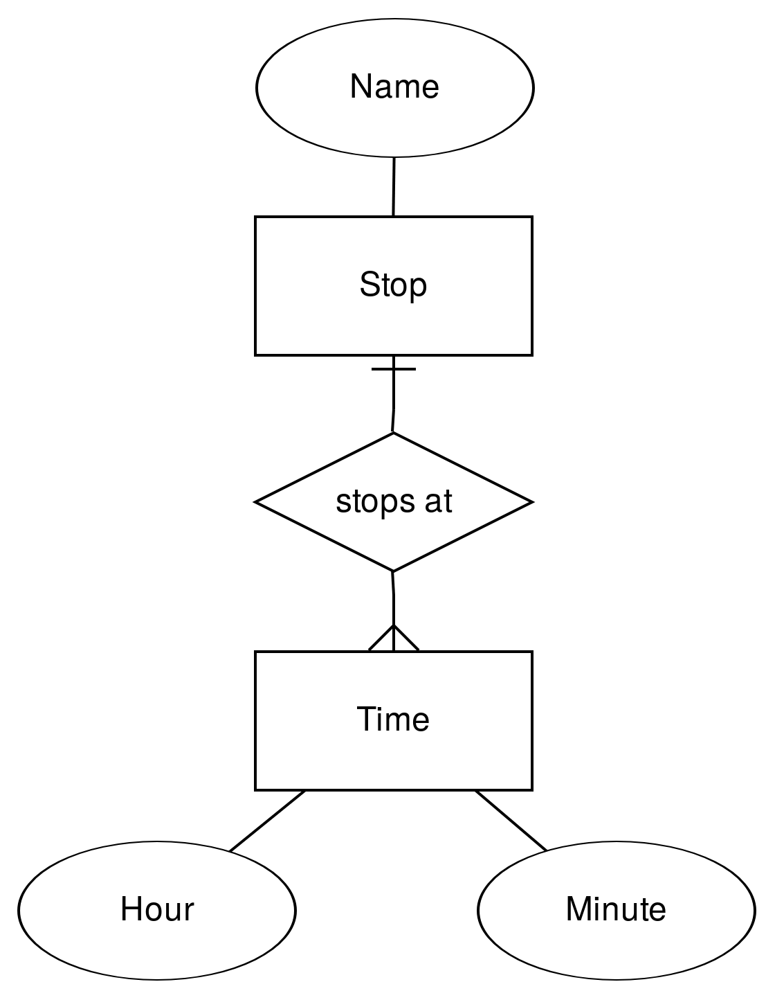

# Současný stav

 <!-- .element: style="float:right;height:700px" -->

- Manuální programování, aka **Webscraping**
    - Ruční tvorba programů, které z HTML kódu extrahují, co je třeba
- Platformy pro zpřístupnění obsahu dokumentů přes API
    - Integrace ručně vytvořených scraperů
    - **Přístup ``manufaktura''**

---

# Inteligentní extrakce

Tzn. bez ``ruční práce'' v podobě hledání elementů, regulárních výrazů, CSS selektorů, XPath výrazů, apod.

1. **Strojové učení**
	- Ručně anotované příklady stránek
	- Z nich se automaticky odvodí parametry wrapperu / extraktoru
2. **Modelem řízená extrakce**
	- Specifikace předpokládané struktury dat
		- Entity, atributy, vztahy (ER diagram?, ještě lépe *ontologie*)
		- Způsob rozpoznání jednotlivých atributů
	- Nalezení výskytu požadovaných skupin dat ve zdrojové stránce

---

# Strojové učení -- scénář

- Trénovací množina dokumentů
	- Obvykle dokumenty z jednoho zdroje
	- Anotace částí obsahu, které se mají extrahovat
	- Odvození pravidel pro extrakci
- Množina nových, neznámých dokumentů
	- Extrakce dat na základě odvozených pravidel

---

# Strojové učení -- metody

- Sekvenční modely stránky (znaky, tokeny)
	- Inference gramatik (*wrapper induction*), skryté Markovovy modely, ...
- Hierarchické modely
	- Zobecněný DOM (odstranění implementačních detailů)
	- Stromové automaty
- Vizuální modely dokumentů
	- Segmentace stránek
	- Klasifikace na základě vizuálních rysů

---

# Modelem řízená extrakce

 <!-- .element: style="float:right;height:700px" -->

- Vstup: Entity, atributy, vztahy
- Přibližné rozpoznání jednotlivých údajů
	- Regulární výrazy
	- Klasifikace textu nebo vizuálních vlastností
	- Mapování na databázi
- Nalezení datových záznamů
	- Využití pravidelnosti, opakující se vzory
