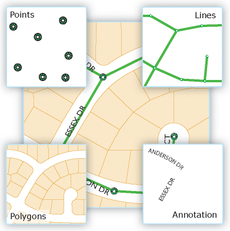

<!-- .slide: class="section" -->

<header>
    <h1>2. Lokace</h1>
    <span>geografická data, EPSG:4326, geocoding, GeoJSON<span>
</header>

---

# Geografická data

- data, která navíc obsahují ***informaci o poloze***
  - bod, hranice, tvar geografického objektu, ...

<br>

<div class="block-center"></div>

<div class="note">Zdroj: <a href="https://doc.esri.com/en/arcgis-pro/latest/help/data/geodatabases/overview/feature-class-basics.html">doc.esri.com</a></div>

---

# Geografická data -- souřadnice

- poloha jako přímý atribut záznamu -- ***lat*** (latitude), ***lon*** (longitude) 

```json
{
  "school": "015530213",
  "schoolName": "Střední průmyslová škola Brno, Purkyňova, příspěvková organizace",
  "lat": 49.225328736636776,
  "lon": 16.580317665828364,
  "value": 45
}
```

<br>

- souřadnice se udávají v souřadnicovém systému **WGS 84**
  - celosvětový standard používaný GPS i webovými mapami
- v dokumentaci se často značí jako ***EPSG:4326***

---

# EPSG:4326

<iframe src="https://epsg.io/map#srs=4326&x=16.596737&y=49.226538&z=16&layer=streets" style="width: 100%; height: 850px; border: none;" allowfullscreen></iframe>

<div class="note">Zdroj: <a href="https://epsg.io/map#srs=4326&x=16.596737&y=49.226538&z=16&layer=streets">epsg.io</a></div>

---

# Automatizované získání geografických souřadnic

- OpenStreetMap má API -- ***Overpass API***
  - vyhledává objekty podle jejich vlastností (tagů).
  - vhodné pro hromadné dotazy.
  - Používá jazyk ***Overpass QL***

```
[out:json][timeout:300];

{{geocodeArea:Czechia}}->.searchArea;

(
  node["amenity"="school"]["isced:level"~"2|3"](area.searchArea);
  way["amenity"="school"]["isced:level"~"2|3"](area.searchArea);
  relation["amenity"="school"]["isced:level"~"2|3"](area.searchArea);
);

out center tags;
```

---

<!-- .slide: class="normal fullspace" -->

# Overpass Turbo

<iframe src="https://overpass-turbo.eu/s/2tLJ" style="width: 100%; height: 900px; border: none;" allowfullscreen></iframe>

<div class="note">Zdroj: <a href="https://overpass-turbo.eu/s/2tLJ">overpass-turbo.eu</a>, stiskněte ▶ Spustit</div>

---

# Geografická data -- reference

- poloha jako ***odkaz/kód*** na geografický celek -- stát, kraj, město...
- samotný záznam souřadnice neobsahuje

```json
{
  "road": "640",
  "suburb": "Královo Pole",
  "city": "Brno",
  "state_district": "okres Brno-město",
  "ISO3166-2-lvl5": "CZ-642",
  "state": "Jihomoravský kraj",
  "ISO3166-2-lvl4": "CZ-64",
  "region": "Jihovýchod",
  "postcode": "612 93",
  "country": "Česko",
  "country_code": "cz"
}
```

---

# Reverzní geocoding

- převod souřadnic na adresu, kód, název geografického celku¨
- možné použít OpenStreetMap API -- ***Nominatim***

```
https://nominatim.openstreetmap.org/reverse?
   lat=49.225328736636776&
   lon=16.580317665828364&
   format=jsonv2&
   addressdetails=1
```

Vyzkoušejte: https://nominatim.openstreetmap.org/reverse?lat=49.225328736636776&lon=16.580317665828364&format=jsonv2&addressdetails=1

<span class="note">Zdroj: <a href="https://nominatim.org/">Nominatim</a></span>

---

# Úkol: prozkoumejte data

<pre class="code-render" src="assets/data/schools-viewer.html" resizable="true" style="height: 800px;"></pre>

<div class="note">Zdroj dat: <a href="assets/data/schools.json"><code>assets/data/schools.json</code></a>, hodnoty value jsou náhodně generované</div>

---

# Definice geografických objektů

- chceme mít znovupoužitelné definice objektů, které se dají sdílet mezi aplikacemi a daty
  - např. definice hranic měst, okresů, krajů, států, ...

```
[out:json][timeout:120];

{{geocodeArea:Czech Republic}}->.cz;

relation
  ["boundary"="administrative"]
  ["admin_level"="4"]
  (area.cz);

out geom;
```

- Pozor, zabírá 20MB -- nutné zjednodušit hranice, např. pomocí https://mapshaper.org/

---

<!-- .slide: class="normal fullspace" -->

# Overpass Turbo

<iframe src="https://overpass-turbo.eu/s/2tLZ" style="width: 100%; height: 900px; border: none;" allowfullscreen></iframe>

<div class="note">Zdroj: <a href="https://overpass-turbo.eu/s/2tLZ">overpass-turbo.eu</a>, stiskněte ▶ Spustit</div>

---

# GeoJSON

- formát pro kódování geografických dat, **[RFC 7946](https://datatracker.ietf.org/doc/html/rfc7946)**
- popisuje *body*, *čáry*, *polygony*, *kolekce objektů* , ...
-  hodnoty reprezentují zeměpisné souřadnice v pořadí **`[ lon, lat ]`** (EPSG:4326)

```json
{ "type": "Point", "coordinates": [ 15.33, 49.74 ] }
{ "type": "LineString", "coordinates": [ [30,10], [10,30], [40, 40] ]}
{ "type": "Polygon", "coordinates": [
    [ [35, 10], [45, 45], [15, 40], [10, 20], [35, 10] ],
    [ [20, 30], [35, 35], [30, 20], [20, 30] ]
  ]
}
...
```

---

# geojson.io

<iframe src="https://geojson.io/?map=5.99/48.9057/17.14766" style="width: 100%; height: 850px; border: none;" allowfullscreen></iframe>

<div class="note">Zdroj: <a href="https://geojson.io/?map=5.99/48.9057/17.14766">geojson.io</a></div>

---

# Úkol: prozkoumejte GeoJSON

<pre class="code-render" src="assets/data/kraje-viewer.html" resizable="true" style="height: 800px;"></pre>

<div class="note">Zdroj dat: <a href="assets/data/kraje.json"><code>assets/data/kraje.json</code></a></div>


