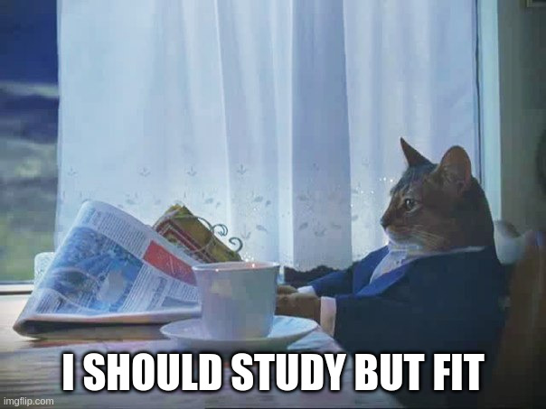

<!-- .slide: class="section" -->

  
  <a href="https://www.fit.vut.cz/applicants/.cs">Studujte na VUT FIT</a>
  ...nebo na MU/ČVUT/.../jděte makat, I don't give a sh*t...

<header>
    <h1>Díky za pozornost!</h1>
</header>
